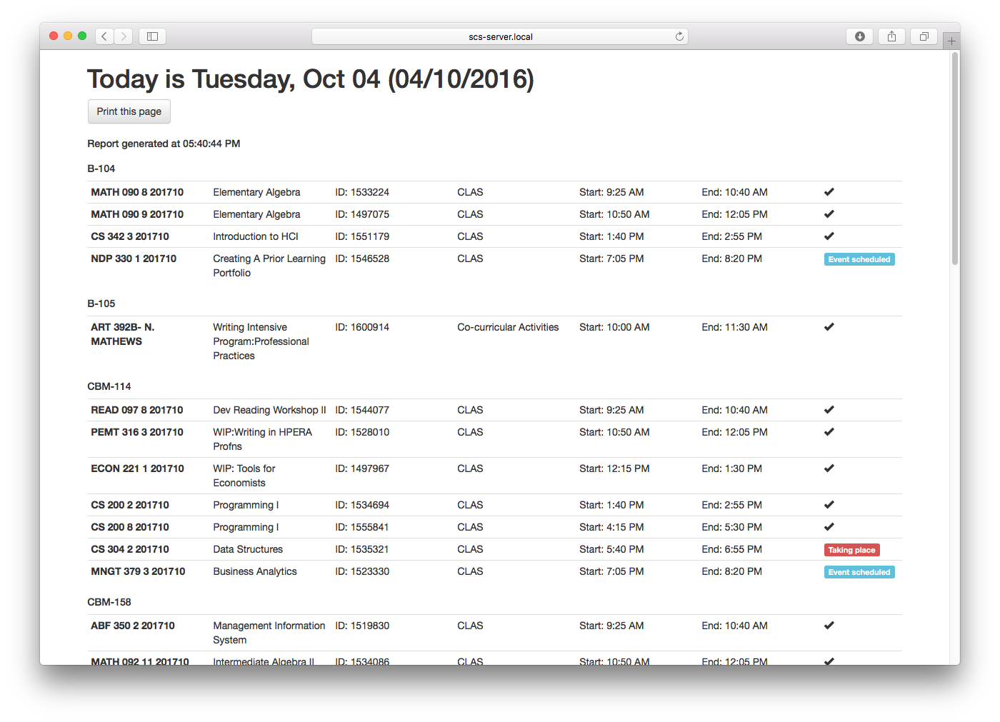
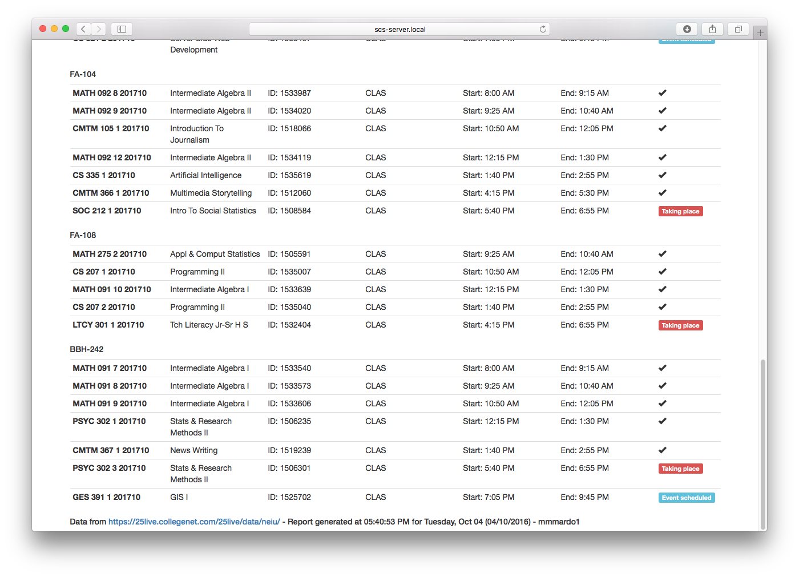
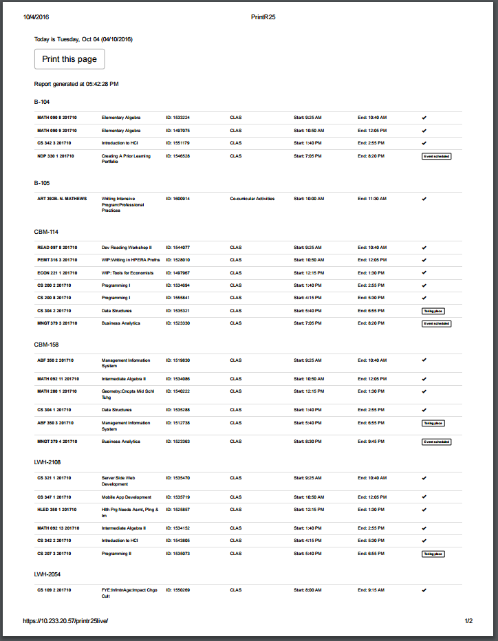

# print25live

## An easy to use XML parser for 25Live.

List generator of all events in specific locations for current day. Easily printable. Helpful for employees who need to check locations and need a printout of all events in fixed locations. Great for lab managers who need a reference sheet for their walkthrough.

List indicates automatically which evens are completed, currently taking place, or scheduled.

What needs to be changed before implementation in your environment:

1. In events.php you have to adjust date_default_timezone_set() to your time zone. 
    `date_default_timezone_set("America/Chicago");`

2. In generate.php you have to adjust direct xml links available on our organization's 25Live page. They usually look like that:
`https://25live.collegenet.com/25live/data/neiu/run/reservations.xml?space_id=368` So, you need to change this: `fetch_location("https://25live.collegenet.com/25live/data/neiu/run/reservations.xml?space_id=368");`
3. Names of locations.`<h3>CBM-158</h3><table class="table table-condensed ">';`

If hit "Print this page", a printout will look as a screenshot below.

